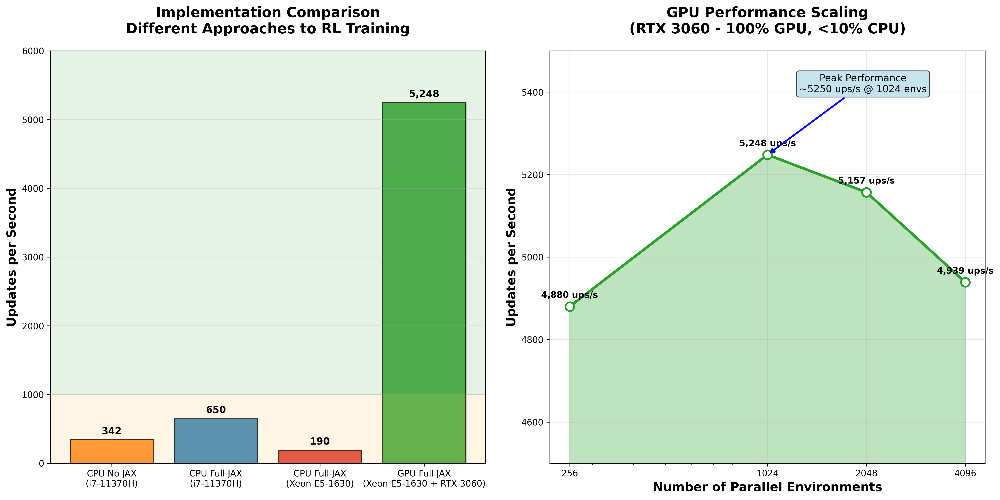
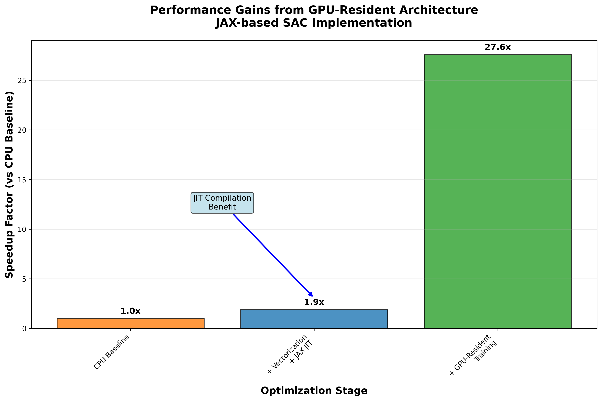
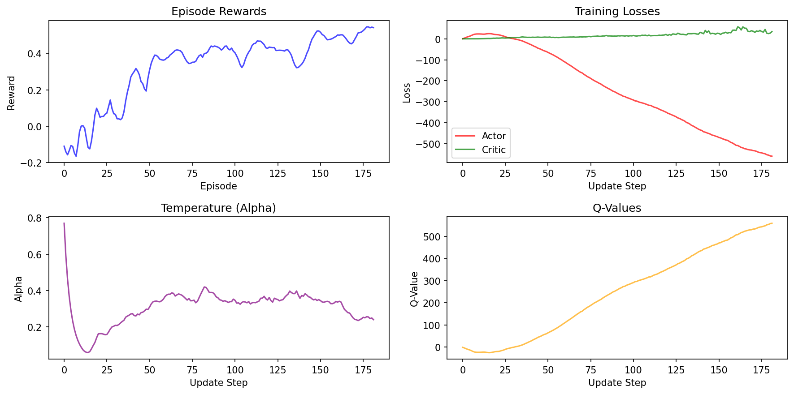
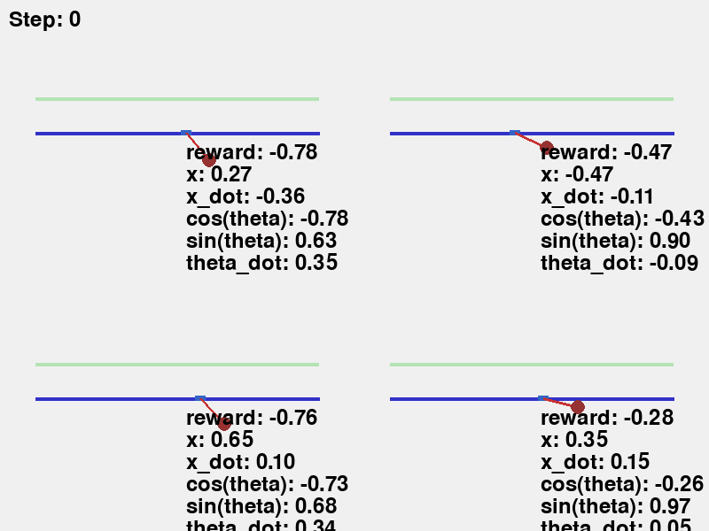
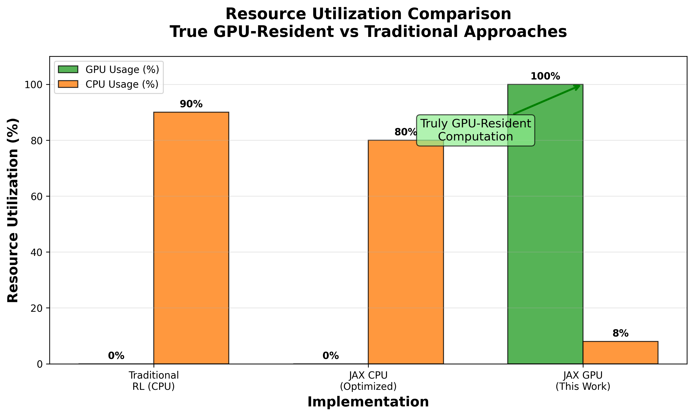

# 🚀 Complete GPU-Resident SAC Implementation

A **from-scratch implementation** of Soft Actor-Critic (SAC) using **pure JAX** for fully GPU-resident reinforcement learning. This project demonstrates a complete RL pipeline that achieves **100% GPU utilization** and **5200+ updates per second** with truly parallel environments and zero host-device transfers during training.


## ✨ Key Features

- **🏗️ Complete GPU Pipeline**: Environment physics, neural networks, replay buffer, and training loop entirely on GPU
- **📈 True GPU Utilization**: 100% GPU usage, <10% CPU usage - genuinely GPU-resident computation
- **🚀 High Performance**: Up to 5,248 parameter updates/second on RTX 3060
- **⚙️ Scalable Parallelism**: Train up to 4096 parallel CartPole agents simultaneously  
- **🔧 Pure JAX Implementation**: Everything built from scratch using JAX primitives
- **🎨 Real-time Visualization**: Live training metrics and environment rendering
- **📊 Zero Host-Device Transfers**: All computation remains on GPU during training

## 🏗️ Architecture Overview

This implementation demonstrates a **truly GPU-resident RL system** built around three core principles:

1. **Pure JAX Implementation**: Environment physics, neural networks, and training logic all implemented from scratch using JAX
2. **Complete GPU Residency**: Zero host-device transfers during training - everything stays on GPU
3. **Vectorized Parallelism**: Up to 4096 environments step in parallel as a single batched operation

> 💡 **Why build from scratch?** While Isaac Gym is faster, this project demonstrates the feasibility of implementing a complete RL pipeline using pure JAX primitives, achieving true GPU residency without external physics engines.

### Core Components

- **Environment**: CartPole physics simulation with vectorized dynamics
- **SAC Algorithm**: Soft Actor-Critic with automatic entropy tuning
- **Chunk Trainer**: Batches multiple training steps for efficient GPU utilization
- **Replay Buffer**: GPU-resident circular buffer for experience storage
- **Visualization**: Real-time plots and environment rendering

## 🚀 Performance Benchmarks

We benchmarked the system with different environment counts to demonstrate GPU scaling:



| Implementation   | Hardware                | Updates/Second | GPU Usage | Speedup                              |
| ---------------- | ----------------------- | -------------- | --------- | ------------------------------------ |
| **CPU No JAX**   | i7-11370H               | **342**        | 0%        | 1.0x                                 |
| **CPU Full JAX** | i7-11370H               | **650**        | 0%        | 1.9x                                 |
| **CPU Full JAX** | Xeon E5-1630            | **190**        | 0%        | 0.6x                                 |
| **GPU Full JAX** | RTX 3060 + Xeon E5-1630 | **5,248**      | 100%      | 27.6x over Full JAX on same hardware |

### 📈 Performance Insights

- **15.3x speedup** from GPU implementation vs legacy CPU approach (342 → 5,248 ups/s)
- **JAX helps on CPU** - 1.9x improvement on modern hardware (342 → 650 ups/s)
- **Hardware matters** - older CPU performs worse even with JAX optimizations
- **GPU transformation** - 100% GPU utilization with <10% CPU usage
- **True GPU residency** - zero host-device transfers during training loops

### 🎯 Environment Scaling Analysis

The GPU implementation shows excellent scaling characteristics across different environment counts:

| Environment Count | Updates/Second  | Efficiency |
| ----------------- | --------------- | ---------- |
| 256 environments  | 4,880 ups/s     | Baseline   |
| 1024 environments | **5,248 ups/s** | **Peak**   |
| 2048 environments | 5,157 ups/s     | -1.7%      |
| 4096 environments | 4,939 ups/s     | -5.9%      |

> 💡 **Sweet Spot**: 1024 parallel environments provides optimal GPU utilization with peak performance.

### 🎯 Optimization Impact

The following chart shows how each architectural improvement contributed to the final performance:



## 🎮 Quick Start

### Installation

```bash
# Clone the repository
git clone https://github.com/BertilBraun/RL-entirely-on-GPU.git
cd RL-entirely-on-GPU

# Install dependencies
# With GPU support
pip install jax[cuda12]
pip install -r requirements.txt
```

### Dependencies

- JAX & JAXLib (GPU support recommended)
- Flax (neural networks)
- Optax (optimizers)
- Chex (testing utilities)
- Matplotlib (visualization)
- NumPy

### Running Training

```bash
# Start training with default configuration (256 parallel environments)
python src/main.py
```

### Configuration

Key parameters can be adjusted in `src/config.py`:

```python
# Training settings
NUM_ENVS = 256                    # Parallel environments
TOTAL_UPDATES = 200_000          # Total training updates
BATCH_SIZE = 256                 # SAC batch size
BUFFER_CAPACITY = 1_000_000      # Replay buffer size

# Network architecture
SAC_CONFIG = SACConfig(
    learning_rate=3e-4,
    gamma=0.995,                 # Discount factor
    tau=0.005,                   # Target network update rate
    hidden_dims=(128, 128),      # Actor/Critic network size
)
```

## 🎯 Training Results

The agent learns to balance the CartPole effectively across all environments:



### Key Metrics

- **Actor Loss**: Policy gradient loss (higher initially, stabilizes)
- **Critic Loss**: Value function approximation error
- **Alpha**: Automatic entropy coefficient (decreases as policy improves)
- **Q-values**: State-action value estimates
- **Reward**: Average episode rewards (improves to positive values)

## 🏭 Implementation Highlights

### Vectorized Environment

```python
@jax.jit
def cartpole_step(state: CartPoleState, force: chex.Array, dt: float, ...) -> CartPoleState:
    """Pure JAX cart-pole physics - processes all environments in parallel"""
    # Traditional cart-pole dynamics with automatic vectorization
    cos_t = jnp.cos(state.theta)
    sin_t = jnp.sin(state.theta)
    # ... physics computation
    return CartPoleState(x=x_new, x_dot=x_dot_new, theta=theta_new, theta_dot=theta_dot_new)
```

### GPU-Resident Training Loop

```python
@partial(jax.jit, static_argnums=(0,))
def run_chunk(self, train_carry: TrainCarry) -> Tuple[TrainCarry, ChunkSummary]:
    """Runs multiple training steps entirely on GPU"""
    carry = ChunkCarry.init(train_carry)
    final_carry, _ = jax.lax.scan(self._one_step, carry, xs=None, length=self.steps_per_gpu_chunk)
    return final_carry.train, ChunkSummary.from_carry(final_carry)
```

### Automatic JIT Compilation

All critical paths are JIT-compiled for maximum performance:

- Environment stepping
- Neural network inference
- Policy and value updates
- Replay buffer operations

## 🎨 Visualization Features

The system includes comprehensive visualization capabilities:

- **Real-time Training Metrics**: Actor/critic losses, rewards, Q-values
- **Live Environment Rendering**: Watch CartPoles learning to balance in real-time
- **Performance Monitoring**: Updates per second, buffer utilization
- **Automatic Saving**: Training plots saved as PNG files
- **GIF Generation**: Create animated GIFs of trained agents for showcasing results



## 🎯 Project Goals & Motivation

This project demonstrates **building a complete RL pipeline from scratch using pure JAX**, achieving true GPU residency without external dependencies like physics engines.

### Why Not Use Isaac Gym?

- **Isaac Gym is faster** - but uses external C++/CUDA physics engines
- **This implementation is educational** - shows how to build everything in JAX
- **Complete transparency** - every component implemented and understandable
- **Pure functional approach** - leverages JAX's functional programming paradigm

### Key Achievement: 100% GPU Utilization

Unlike traditional RL implementations that shuffle data between CPU and GPU, this system achieves:

- **0% CPU involvement** during training loops
- **100% GPU utilization** - all computation on device
- **Zero host-device transfers** - truly GPU-resident



## 🔬 Technical Deep Dive

### Why JAX?

- **Functional Programming**: Immutable state, pure functions
- **Automatic Differentiation**: Native gradient computation
- **JIT Compilation**: XLA optimization for maximum performance
- **Vectorization**: `vmap` for parallel operations
- **GPU Acceleration**: Seamless device placement

### Chunk-Based Training

Instead of updating after every environment step, we:

1. Run multiple environment steps on GPU
2. Batch all replay buffer operations
3. Perform multiple SAC updates in sequence
4. Transfer minimal data back to host for logging

This approach maximizes GPU utilization and minimizes host-device synchronization overhead.

## 🛠️ Project Structure

```
src/
├── algorithms/          # RL algorithms
│   ├── sac.py          # Soft Actor-Critic implementation
│   └── replay_buffer.py # GPU-resident experience replay
├── environment/         # Environment implementations
│   └── cartpole.py     # Vectorized CartPole physics
├── networks/           # Neural network architectures
│   ├── actor.py        # Policy network
│   └── critic.py       # Value networks
├── training/           # Training infrastructure
│   ├── chunk_trainer.py # GPU-optimized training loop
│   └── data_structures.py # Training state management
├── utils/              # Utilities
│   ├── training_viz.py # Training visualization
│   └── cartpole_viz.py # Environment rendering
├── config.py           # Configuration parameters
└── main.py            # Main training script
```

## 🎯 Future Extensions

This implementation demonstrates the feasibility of pure JAX RL systems and could be extended to:

- **Different Environments**: More complex control tasks (continuous control, robotics)
- **Advanced Algorithms**: PPO, IMPALA, or other RL algorithms
- **Distributed Training**: Multi-GPU setups for even larger scale
- **Hyperparameter Optimization**: Better learning speed through parameter tuning

> 💡 **Note**: This is an educational implementation demonstrating JAX capabilities. For production use, Isaac Gym and similar frameworks may offer better performance through optimized physics engines.

## 📄 License

This project is open source and available under the MIT License.

---

*A complete GPU-resident RL implementation built from scratch with JAX! 🚀*
